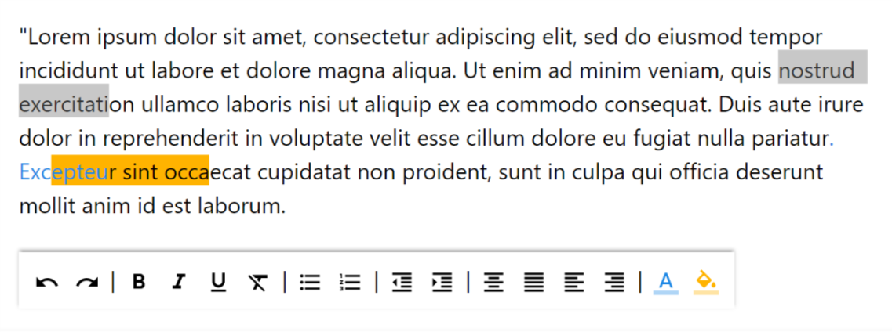

# `<html-editor>`

This is a web-component, lightweight, bare bones HTML editor that wraps the HTML in an `<iframe sandbox>` so that malicious scripts embedded in the HTML cannot execute in your page.

## Why another rich text editor?

I have a couple of restrictions:

* Must be compatible with web components and shadow DOM. 
* Must handle a wide variety of possibly dodgy HTML.
* Should work when imported as a module or asychronously brought into the page.
* Should be open source.

Unfortunately those rule out every HTML editor component I've been able to find. Shadow DOM means libraries that rely on `document...` methods (like the otherwise excellent [Quill](https://github.com/quilljs/quill)) can't work. Those that do work are too easy to inject `
    
Include the tag in your HTML:

    <sandbox-editor content={{HTML content to edit}}>
         Custom toolbar buttons here
    </sandbox-editor>
    
The `content` attribute (it can also be set as a property) holds the HTML to set. `content-changed` fires when the user updates the HTML. This is compatible with [Polymer's `notify` properties](https://www.polymer-project.org/2.0/docs/devguide/properties), so you can use its two-way binding.

To execute commands against the editor call `editorAction`:

    const sandbox = parentElement.querySelector('sandbox-editor');
    sandbox.editorAction('bold'); // make the current selection bold
    sandbox.editorAction('backColor', '#fdb5fb'); // make the background pink

For an example of this see the [source of `<html-editor>`](html-editor.html)

### `<html-editor>`

Include the HTML import:

    <link rel="import" href="{path}/html-editor/html-editor.html" />

Include the tag in your HTML:

    <html-editor content={{HTML content to edit}}></html-editor>

The `content` attribute (it can also be set as a property) holds the HTML to set, Polymer two-way databinding is supported.

